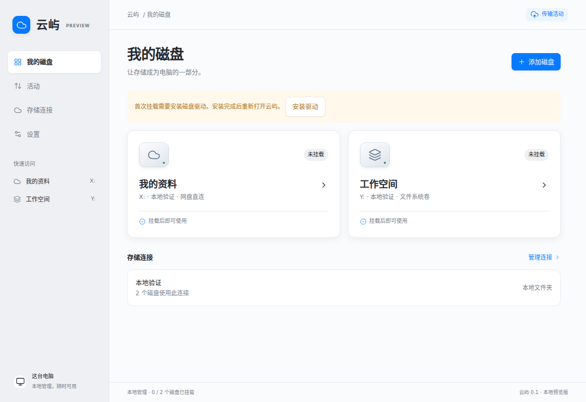

# OneMount · 云屿

Windows 桌面存储管理器。统一管理账号、挂载、缓存与传输状态，用户不用执行命令或编辑底层配置。

当前为 **0.1.2 预览版**。产品界面名为「云屿」，仓库名为 OneMount。



## 已实现

- **网盘直连**：内部 rclone 1.75.0 + WinFsp，完整读写缓存，文件关闭并空闲 5 秒后上传。
- **文件系统卷**：内部 JuiceFS 1.3.0，通过本机、需要认证的 S3 网关连接 rclone 后端。网关缓存关闭，避免双重异步写回；卷默认关闭 writeback。
- 软件内连接本地文件夹、WebDAV、S3 兼容存储，检查连接与选择目录。
- 软件接管 OAuth 状态机、系统浏览器授权、问题选择、取消和超时。OneDrive、Google Drive、Dropbox 须先配置发布者自己的 OAuth 应用，才开放登录入口。
- 每个磁盘独立缓存目录；文件系统卷使用独立远端前缀和本地 SQLite 元数据。
- 直连模式显示文件上传队列；文件系统卷显示待上传块数和字节数。未知状态不会显示成已上传。
- 安全卸载、托盘后台运行、启动时挂载、Windows 登录后启动。
- 账号配置加密，解密密码和网关认证信息由 Windows 当前账户加密保护。
- 关闭 JuiceFS usage 上报；初始化禁用更新检查；无应用遥测。

## 使用 Windows 软件包

1. 完整解压 Windows x64 软件包，双击 `CloudIsland.exe`。不需要安装 Node.js，也不需要单独下载两个引擎。
2. 如提示缺少磁盘驱动，点击「安装驱动」，从官方页面安装 WinFsp 后重启软件。它是系统驱动依赖，不包含在此便携包中。
3. 「存储连接 → 添加连接 → 本地文件夹」，选择一个空目录作为验证后端。
4. 「我的磁盘 → 添加磁盘」，分别创建网盘直连 X: 和文件系统卷 Y:，点击「挂载磁盘」。
5. 在资源管理器中新建、读取、修改文件；关闭文件，等待上传完成，点击「安全卸载」。再次挂载验证持久化。

**0.1.2 已通过真实 Windows + WinFsp 挂载与打包界面自动化验收，包括独立普通用户。** 本次环境为 Windows Server 2025（10.0.26100），后端为本地测试目录；未覆盖真实网盘 OAuth 或 Windows 10/11 逐版本验收，软件尚未代码签名。结果及边界见 [WINDOWS-VALIDATION.md](WINDOWS-VALIDATION.md)。

## 开发与构建

Windows 10/11 x64、Node.js 24、PowerShell、系统自带 tar。

```powershell
npm ci
npm run engines:win
npm run install:electron
npm test
npm start
npm run package:win
```

便携软件输出到 `dist/CloudIsland-win32-x64/`。整个目录一起分发。两个引擎包含在 `resources/engines/`；下载脚本固定版本并校验 SHA-256。Git 不保存大体积引擎二进制，避免超过 GitHub 单文件限制。

推送 main 或手动运行 GitHub Actions 后，可在成功的 `Windows preview build` 工作流的 Artifacts 中下载 `OneMount-Windows-x64-preview`。该工作流安装 WinFsp，执行真实挂载、PowerShell 读写、冷缓存重挂校验以及打包 EXE 界面测试；另以独立普通用户重复验收。所有门禁通过后才上传软件包，日志和界面截图在 `Windows-validation-evidence` 中。

## 自有品牌账号授权

最终用户的流程是「添加服务 → 浏览器授权 → 选择目录」。不提供导入底层配置、执行命令行或显示原始配置问答的入口。

第三方授权页展示的应用名由 OAuth 注册决定。默认构建不使用 rclone 内置的公共 Client ID，避免授权页出现不属于本产品的名称。发布者应注册自己的桌面 OAuth 应用，把显示名设为「云屿」或 OneMount，配置相应权限与重定向地址。

1. 按 `oauth-clients.json` 格式新建 `oauth-clients.local.json`（已被 Git 忽略）。
2. 填写 `onedrive`、`drive`、`dropbox` 对应的 `clientId`、`clientSecret`，执行 `npm run release:config`。
3. 执行打包。未配置的服务会显示「等待发布者开放登录」。

也可通过 `ONEMOUNT_OAUTH_ONEDRIVE_CLIENT_ID` 等环境变量注入。桌面程序中的 Client Secret 可被提取，不能把它当成服务器端保密凭据；应按各厂商对本机应用的要求注册。回调使用内置引擎的本机回调端口 `53682`，常见 URI 为 `http://localhost:53682/`；具体提供商要求请以其官方注册指南为准。

授权控制由 `src/accounts.cjs` 实现，使用 `config/create` / `config/update` 非交互问答协议、异步任务和 `config/oauthstatus` / `config/oauthstop`。授权成功页已替换为本产品页面。真实第三方授权尚未在此环境验证，因为没有发布者 OAuth 应用与测试账号。

## 数据与生命周期

默认数据在 `%APPDATA%/CloudIsland`。账号密文、磁盘配置、元数据和缓存均保留在当前账户下。

- 直连：`rcd` → `mount/mount`；卸载前检查上传队列、缓存错误和脏缓存元信息，再调用 `mount/unmount`，最后退出后台进程。
- 文件系统卷：启动独立 `serve s3` → 检查服务 → 仅对全新卷 format → 启动挂载；卸载执行 `umount --flush`，等挂载进程真正退出后才停止网关。
- 每卷固定本机 S3 端口，重启保持一致。端口被占用时拒绝启动，不偷偷改写已格式化卷的地址。
- 意外退出后保留缓存与元数据。重新启动会尝试接管仍存活且能够通过认证的后台会话；不通过进程名批量终止程序。
- 移除磁盘只归档配置，不删除远端数据、元数据和缓存。没有「强制退出并删除缓存」按钮。
- Windows 挂载保留 JuiceFS/WinFsp 的当前用户默认映射，不传入自定义 `uidmap` 或不支持的 `--umask`。`--as-root` 只设置内部 POSIX 身份，不要求以 Windows 管理员身份运行主程序。

## 当前边界

- 仅面向 Windows x64 单机。SQLite 元数据不会自动在多台电脑之间共享或备份，不是分布式协调服务。
- `rclone serve s3` 上游仍为实验功能。此前 objbench 测试发现边界 Range、列表/marker 和 multipart 兼容问题；本项目验证的是常用块读写及重启回读链路，未宣称完整 S3 兼容或生产级可靠性。
- 安全卸载要求先关闭访问磁盘的程序。队列清空不能代表其他应用不再产生新写入，系统关机/断电无法保证尚在内存中的写入安全。
- 本版不提供跨设备一致性承诺、文件系统卷的文件级上传进度、手动缓存删除、共享卷或本地固定磁盘外观选项。
- 账号重新授权时先移除使用它的磁盘配置，再移除账号、重新连接。卷数据不会删除，恢复已归档卷目前需要开发者操作，尚无恢复向导。

## 验证与结构

`npm test`：配置校验、磁盘冲突、Windows 挂载参数、私有端点、未知状态、卸载队列保护、数据归档与 IPC 安全约束。

Linux 无 FUSE 的集成验证：

```bash
TEST_RCLONE=/absolute/rclone TEST_JUICEFS=/absolute/juicefs node scripts/integration.cjs
```

真实引擎测试覆盖加密账号配置、S3 账号接入、目录选择、初始化、六种大小/中文路径文件、网关重启、覆盖写入与删除后的 SHA-256 回读。记录见 [INTEGRATION-RESULTS.json](INTEGRATION-RESULTS.json)。

`scripts/ui-smoke.mjs` 是 Electron 自动化交互测试，依赖 Playwright，运行在无显示器的 Linux 测试容器中；测试专用临时 AES 密钥替代 Windows DPAPI，生产程序使用系统密钥保护。截图展示的是测试创建的未挂载磁盘，没有伪造在线状态或传输数据。

源码分工：`src/manager.cjs` 生命周期；`src/accounts.cjs` 账号；`src/plans.cjs` 参数；`src/processes.cjs` 子进程和本机控制接口；`src/main.cjs` 桌面和 IPC；`ui/` 产品界面。

应用源码 MIT；内置组件及图标版权见 [THIRD-PARTY-NOTICES.md](THIRD-PARTY-NOTICES.md)。
